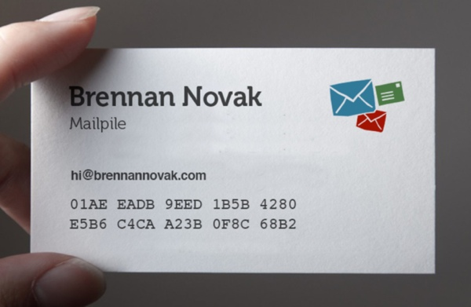

Key Verification
================

With public/privacy key cryptography, **fingerprints** are absolutely needed in order to verify a PGP key.  Examples, experiments and tools to help with PGP fingerprint verifications. 

## Fingerprints

The most common method of verifying a PGP key is comparing "fingerprints" by looking at a string of numbers & letters like `01AE EADB 9EED 1B5B 4280 E5B6 C4CA A23B 0F8C 68B2` on two screens or a piece of paper & a screen and making sure the characters match. 

-

### Visual Fingerprints

An idea that has been popping up more and more and representing fingerprints with visual elements like icons, symbols, and colors. The goal of this is to make it easier for the human eye to glance and two representations of a key and discern if it is the same or not.

- [Iconify](https://github.com/RaedsLab/Iconify) is a promising library that turns "ugly hashes into beautiful icons"

